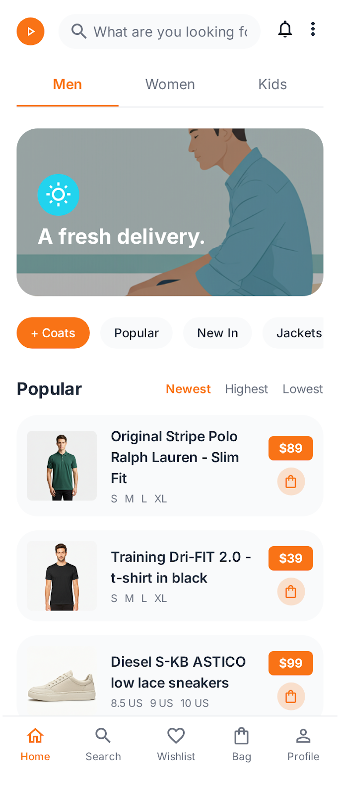
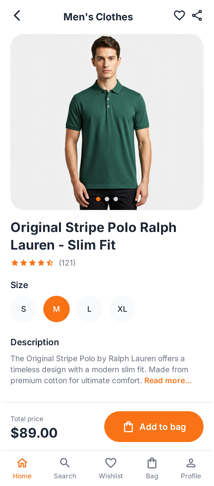

# �️ React Native OpenCart Mobile App

A modern, high-performance mobile e-commerce application built with React Native, showcasing seamless integration with OpenCart's powerful backend system.

<div align="center">
  <p align="center">
    Transform your OpenCart store into a modern mobile shopping experience
  </p>
</div>

## 📱 App Screenshots

<div align="center">
  <p align="center">
    
    &nbsp;&nbsp;&nbsp;&nbsp;
    
  </p>
  <p align="center">
    <i>Left: Home Screen with category and product browsing | Right: Product detail view with size selection</i>
  </p>
</div>

## ✨ Key Features

### 🎨 Modern UI/UX
- **Intuitive Navigation**: Bottom tab navigation for seamless access to all features
- **Responsive Design**: Fluid layouts that adapt to any screen size
- **Custom Components**: Beautifully crafted UI elements
- **Smooth Animations**: Enhanced user experience with fluid transitions

### � Shopping Experience
- **Smart Product Browse**: Advanced filtering and sorting capabilities
- **Category Navigation**: Easy-to-use category browsing
- **Search Functionality**: Quick product search with suggestions
- **Wishlist**: Save favorite items for later
- **Shopping Cart**: Efficient cart management with quantity controls

### � User Features
- **Profile Management**: Comprehensive user profile system
- **Order History**: Track past and current orders
- **Multiple Addresses**: Manage multiple shipping locations
- **Payment Methods**: Secure payment method management
- **Notifications**: Stay updated with order status

## 🔧 Technical Stack

- **Frontend**:
  - React Native
  - TypeScript
  - React Navigation
  - React Native Vector Icons
  - Context API for state management

- **Backend Integration**:
  - OpenCart REST API
  - Secure authentication
  - Real-time data synchronization
  - Efficient caching strategies

## 💡 OpenCart Expertise

This project demonstrates advanced OpenCart integration capabilities:

### 🔌 API Integration
- Custom API endpoints utilization
- Efficient data fetching and caching
- Real-time inventory synchronization
- Secure authentication implementation

### 🛠️ Extended Features
- Enhanced product filtering
- Advanced search capabilities
- Custom order processing
- Multi-language support
- Currency conversion

### � Security Implementation
- JWT authentication
- Secure payment processing
- Data encryption
- Session management

## 🚀 Getting Started

1. **Clone the repository**
   ```bash
   git clone https://github.com/ashrafsaqib/react-native-opencart-app.git
   ```

2. **Install dependencies**
   ```bash
   cd react-native-opencart-app
   npm install
   ```

3. **Configure OpenCart API**
   ```typescript
   // config.ts
   export const API_URL = 'your-opencart-api-url';
   ```

4. **Run the app**
   ```bash
   # iOS
   npx react-native run-ios
   
   # Android
   npx react-native run-android
   ```

## 📁 Project Structure

```
src/
├── api/          # OpenCart API integration
├── components/   # Reusable UI components
├── context/     # React Context providers
├── screens/     # Screen components
└── navigation/  # Navigation configuration
```

## 🤝 Contributing

Contributions are welcome! Feel free to submit issues and enhancement requests.

1. Fork the Project
2. Create your Feature Branch (`git checkout -b feature/AmazingFeature`)
3. Commit your Changes (`git commit -m 'Add some AmazingFeature'`)
4. Push to the Branch (`git push origin feature/AmazingFeature`)
5. Open a Pull Request

## � Contact

Saqib Ashraf - [LinkedIn](https://linkedin.com/in/YourProfile)

Project Link: [https://github.com/ashrafsaqib/react-native-opencart-app](https://github.com/ashrafsaqib/react-native-opencart-app)

## 🏷️ Tags

`#react-native` `#opencart` `#e-commerce` `#mobile-app` `#typescript` `#shopping-app` `#react-navigation` `#api-integration` `#ui-ux` `#mobile-commerce`
